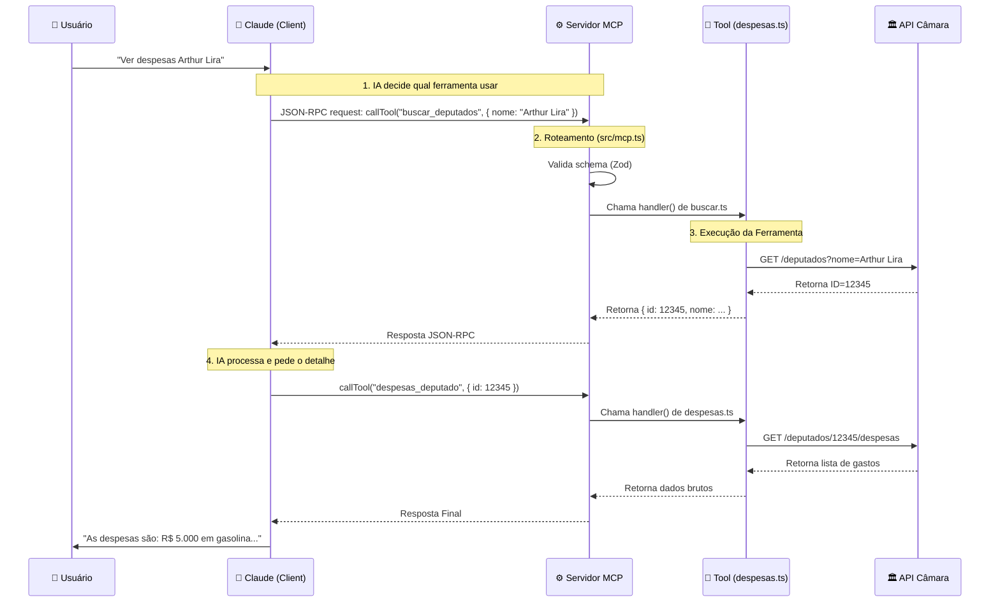
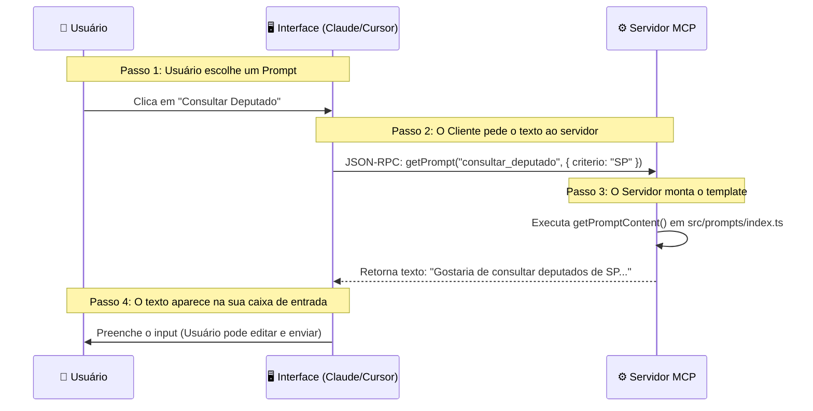

# 📘 Como Funciona: Projeto AgenteCidadaoMCP (Detalhado)

Este documento explica minuciosamente a arquitetura do projeto localizado em `c:\Users\g_cav\projects\AgenteCidadao\AgenteCidadaoMCP`.

---

## 1. 🏗️ Visão Geral

O projeto é um **Servidor MPC** que atua como adaptador.
*   **Entrada:** Protocolo JSON-RPC (entendido por IAs).
*   **Saída:** Requisições HTTP REST (entendidas pela Câmara dos Deputados).

---

## 2. 🔄 Ciclo de Vida da Execução (Quem chama quem?)

Abaixo está o fluxo exato de execução, desde o momento em que você aperta "Enter" no comando.

### Fase A: Inicialização (`Boot`)

1.  **Node.js** executa `dist/server.js` (o código compilado de `src/server.ts`).
2.  **`src/server.ts`** (Linha 52): Chama a função `main()`.
    *   Carrega configurações (`src/config.ts`).
    *   Instancia a classe principal: `const server = new CamaraMCPServer();`
3.  **`src/mcp.ts`** (Linha 46): O construtor é executado.
    *   Cria o servidor SDK: `new Server(...)`.
    *   Chama `setupHandlers()`: Define como responder a pedidos de lista de ferramentas e chamadas de função.
4.  **`src/mcp.ts`** (Linha 16-41): Importa todas as ferramentas.
    *   *Ex:* Importa `deputadosTools` de `src/tools/deputados/index.ts`.
    *   *Ex:* O arquivo `index.ts` por sua vez importa `buscar.ts`, `despesas.ts`, etc.
    *   Resultado: A variável `allTools` contém uma lista gigante com todas as 57 ferramentas prontas para uso.
5.  **`src/server.ts`** (Linha 17): Chama `server.start()`.
    *   Conecta o transporte `StdioServerTransport`.
    *   Agora o servidor está "ouvindo" a entrada padrão (stdin) do sistema.

### Fase B: O Pedido da IA (`Runtime`)

Imagine que o usuário (você) pergunta ao Claude: *"Quais as despesas do deputado Arthur Lira?"*

---

## 3. 📝 E os Prompts? Quem chama?

Você deve ter visto a pasta `src/prompts`. Eles funcionam **antes** ou **durante** a conversa para guiar o usuário.

**Quem chama?** O Cliente (Claude Desktop/Cursor).
**Quando?** Quando você clica em "Usar Prompt" ou digita um comando de barra (/).

O fluxo é diferente das ferramentas. O Prompt não executa nada na Câmara, ele apenas **preenche o seu chat** com um texto inteligente.

Ou seja:
*   **Prompts (`src/prompts/`)**: Ajudam o **Usuário** a saber o que perguntar.
*   **Tools (`src/tools/`)**: Ajudam a **IA** a buscar a resposta.

---

## 4. 🔍 Detalhamento das Camadas

### Camada 1: O Porteiro (`src/server.ts`)
*   **Função:** Apenas inicia tudo. É simples de propósito.
*   **Analogia:** É a chave que liga o carro.

### Camada 2: O Roteador (`src/mcp.ts`)
*   **Função:** Recebe o JSON da IA e decide para qual arquivo mandar.
*   **Código Crítico:** O método `server.setRequestHandler(CallToolRequestSchema, ...)` (Linha 112).
    *   Ele pega o `name` da ferramenta (ex: "buscar_deputados").
    *   Procura na lista `allTools`.
    *   Executa `tool.handler(args)`.
    *   Se der erro, ele captura e devolve uma mensagem bonita para a IA não travar.

### Camada 3: A Lógica de Negócio (`src/tools/`)
*   **Função:** Sabe *o que* fazer com os dados.
*   **Exemplo (`src/tools/deputados/despesas.ts`):**
    1.  Recebe `id`.
    2.  Verifica se tem no Cache (`src/core/cache.ts`).
    3.  Se não, constrói a URL: `/deputados/${id}/despesas`.
    4.  Usa o Cliente HTTP (`src/api/client.ts`) para buscar.

### Camada 4: Infraestrutura (`src/core/`)
*   **`rate-limiter.ts`**: Conta quantas requisições fizemos no último minuto. Se passar de 150, ele faz o código "dormir" um pouco antes de continuar.
*   **`circuit-breaker.ts`**: Monitora falhas. Se 5 requisições falharem seguidas, ele "abre o disjuntor" e rejeita novas chamadas imediatamente por 60 segundos, para proteger a API da Câmara de sobrecarga (e proteger nós de sermos banidos).

---

## 4. 🧩 Por que tantos arquivos?

Poderíamos fazer tudo em um arquivo só (como no `mcp_didatico`), mas separamos para:

1.  **Escalabilidade**: Com 57 ferramentas, um arquivo único teria 10.000 linhas.
2.  **Manutenção**: Se a URL de "Deputados" mudar, só mexemos na pasta `deputados`.
3.  **Segurança**: O tratamento de erros fica centralizado no `mcp.ts`, ninguém esquece de tratar erro.

Este projeto segue os padrões de mercado para aplicações Node.js de grande porte.
