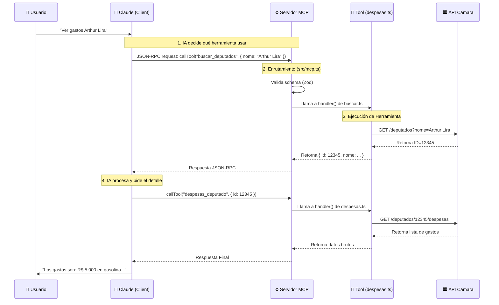
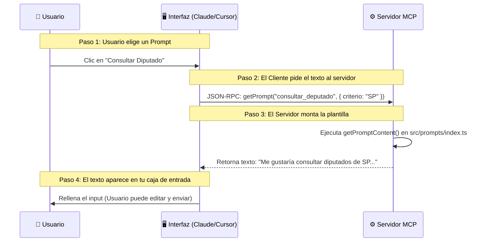

# 📘 Cómo Funciona: Proyecto AgenteCidadaoMCP (Detallado)

Este documento explica minuciosamente la arquitectura del proyecto ubicado en `c:\Users\g_cav\projects\AgenteCidadao\AgenteCidadaoMCP`.

---

## 1. 🏗️ Visión General

El proyecto es un **Servidor MCP (Model Context Protocol)** completo y robusto.
*   **Entrada:** Protocolo JSON-RPC (entendido por IAs).
*   **Salida:** Peticiones HTTP REST (entendidas por la Cámara de Diputados de Brasil).

---

## 2. 🔄 Ciclo de Vida de Ejecución (¿Quién llama a quién?)

A continuación, se detalla el flujo exacto de ejecución, desde el momento en que presionas "Enter" en el comando.

### Fase A: Inicialización (`Boot`)

1.  **Node.js** ejecuta `dist/server.js` (el código compilado de `src/server.ts`).
2.  **`src/server.ts`** (Línea 52): Llama a la función `main()`.
    *   Carga configuraciones (`src/config.ts`).
    *   Instancia la clase principal: `const server = new CamaraMCPServer();`
3.  **`src/mcp.ts`** (Línea 46): Se ejecuta el constructor.
    *   Crea el servidor SDK: `new Server(...)`.
    *   Llama a `setupHandlers()`: Define cómo responder a solcitudes de lista de herramientas y llamadas de función.
4.  **`src/mcp.ts`** (Líneas 16-41): Importa todas las herramientas.
    *   *Ej:* Importa `deputadosTools` de `src/tools/deputados/index.ts`.
    *   *Ej:* El archivo `index.ts` a su vez importa `buscar.ts`, `despesas.ts`, etc.
    *   Resultado: La variable `allTools` contiene una lista gigante con las 57 herramientas listas para usar.
5.  **`src/server.ts`** (Línea 17): Llama a `server.start()`.
    *   Conecta el transporte `StdioServerTransport`.
    *   Ahora el servidor está "escuchando" la entrada estándar (stdin) del sistema.

### Fase B: La Petición de la IA (`Runtime`)

Imagina que el usuario (tú) pregunta a Claude: *"¿Cuáles son los gastos del diputado Arthur Lira?"*

---

## 3. 📝 ¿Y los Prompts? ¿Quién los llama?

Debes haber visto la carpeta `src/prompts`. Funcionan **antes** o **durante** la conversación para guiar al usuario.

**¿Quién llama?** El Cliente (Claude Desktop/Cursor).
**¿Cuándo?** Cuando haces clic en "Usar Prompt" o escribes un comando de barra (/).

El flujo es diferente al de las herramientas. El Prompt no ejecuta nada en la Cámara, simplemente **rellena tu chat** con un texto inteligente.

Es decir:
*   **Prompts (`src/prompts/`)**: Ayudan al **Usuario** a saber qué preguntar.
*   **Tools (`src/tools/`)**: Ayudan a la **IA** a buscar la respuesta.

---

## 4. 🔍 Detalle de las Capas

### Capa 1: El Portero (`src/server.ts`)
*   **Función:** Solo inicia todo. Es simple a propósito.
*   **Analogía:** Es la llave que enciende el coche.

### Capa 2: El Enrutador (`src/mcp.ts`)
*   **Función:** Recibe el JSON de la IA y decide a qué archivo enviarlo.
*   **Código Crítico:** El método `server.setRequestHandler(CallToolRequestSchema, ...)` (Línea 112).
    *   Este toma el `name` de la herramienta (ej: "buscar_deputados").
    *   Busca en la lista `allTools`.
    *   Ejecuta `tool.handler(args)`.
    *   Si hay error, lo captura y devuelve un mensaje amable para no bloquear a la IA.

### Capa 3: La Lógica de Negocio (`src/tools/`)
*   **Función:** Sabe *qué* hacer con los datos.
*   **Ejemplo (`src/tools/deputados/despesas.ts`):**
    1.  Recibe `id`.
    2.  Verifica si está en Caché (`src/core/cache.ts`).
    3.  Si no, construye la URL: `/deputados/${id}/despesas`.
    4.  Usa el Cliente HTTP (`src/api/client.ts`) para buscar.

### Capa 4: Infraestructura (`src/core/`)
*   **`rate-limiter.ts`**: Cuenta cuántas peticiones hicimos en el último minuto. Si pasa de 150, hace "dormir" al código un poco antes de continuar.
*   **`circuit-breaker.ts`**: Monitorea fallos. Si 5 peticiones fallan seguidas, "abre el disyuntor" y rechaza nuevas llamadas inmediatamente por 60 segundos, para proteger la API de la Cámara de sobrecarga (y protegernos de ser baneados).

---

## 5. 🧩 ¿Por qué tantos archivos?

Podríamos hacer todo en un solo archivo (como en `mcp_didatico`), pero los separamos por:

1.  **Escalabilidad**: Con 57 herramientas, un archivo único tendría 10.000 líneas.
2.  **Mantenimiento**: Si la URL de "Deputados" cambia, solo tocamos la carpeta `deputados`.
3.  **Seguridad**: El manejo de errores está centralizado en `mcp.ts`, nadie olvida tratar un error.

Este proyecto sigue los patrones de mercado para aplicaciones Node.js de gran porte.
